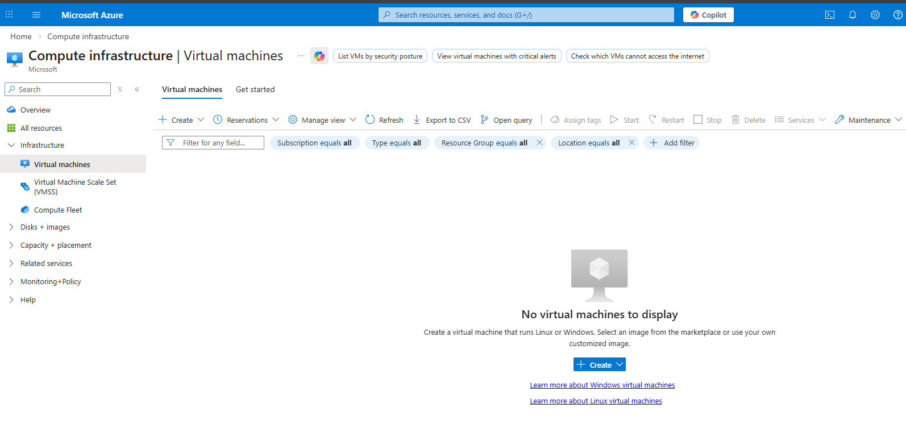
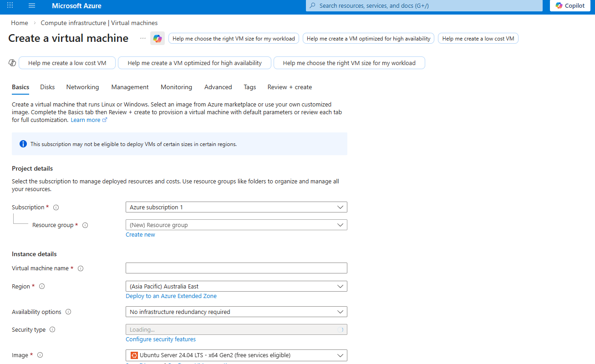
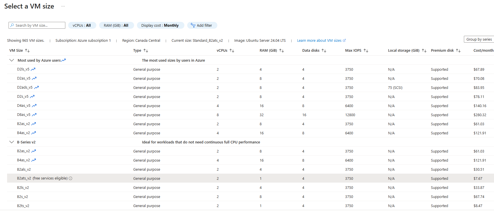
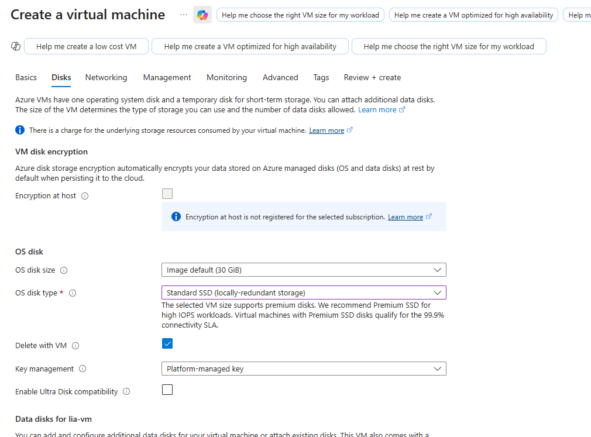
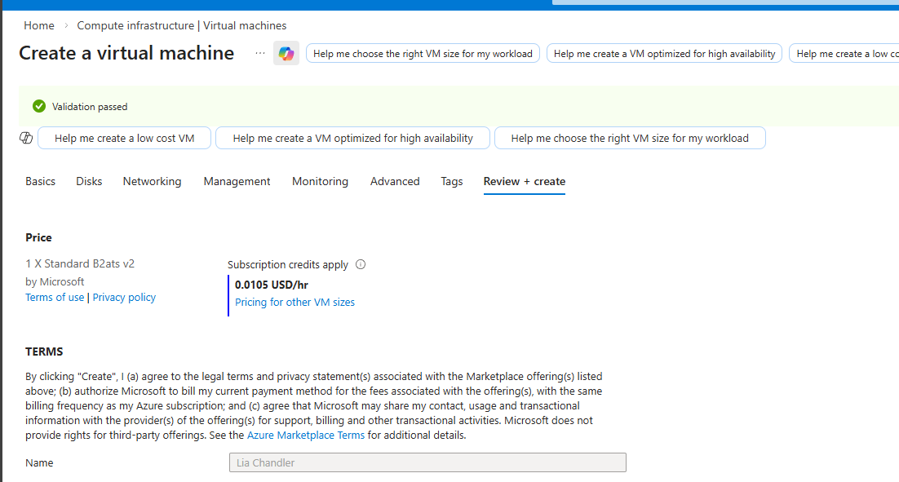

# Prerequisites and VM Deployment

**Project**: Create a Linux VM and serve a basic website on Azure — concise cloud engineering lab for portfolio.

**Goal**: Provision a Ubuntu VM in Azure with SSH key-based access and a minimal Nginx web server.

**Tools / Skills**: Azure Portal, VM sizing, networking, SSH key generation, Nginx, basic troubleshooting.

## Prerequisites

- Azure subscription and contributor access.
- Local SSH client and ability to paste a public key.

## Quick deployment summary

1. Authenticate to Azure and open the Virtual Machines blade.
   
2. Start VM creation and choose Linux (Ubuntu) image; set resource name and region.
   
   
3. Configure compute size and disk options for a small test workload.
   
   
4. Configure networking: place VM on an existing or new VNet/subnet and accept defaults for a lab.
   
5. Validate and deploy the VM; verify provisioning succeeded.
   
   

**Outcome**: A running VM resource is provisioned and visible in the portal for subsequent SSH and web setup.
