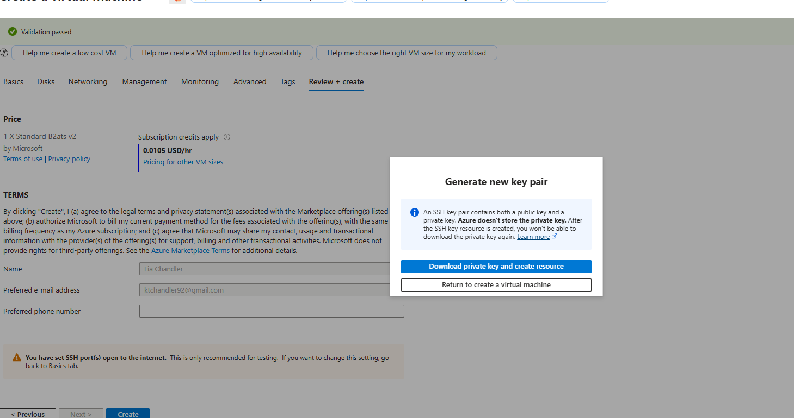
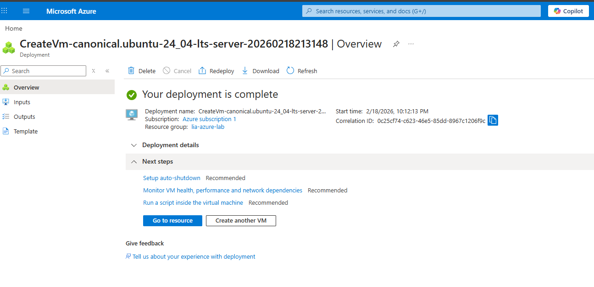
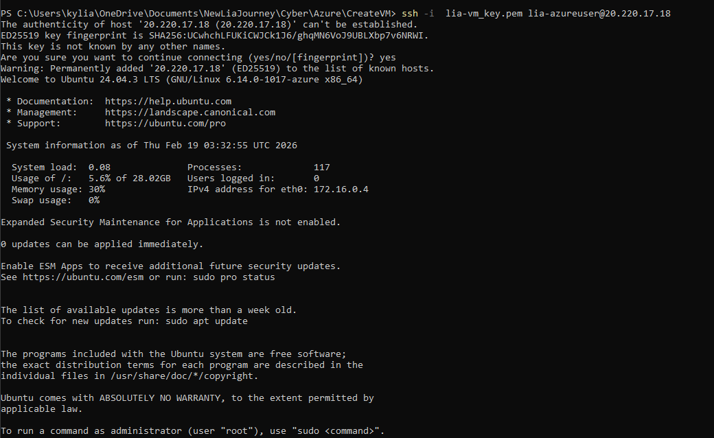
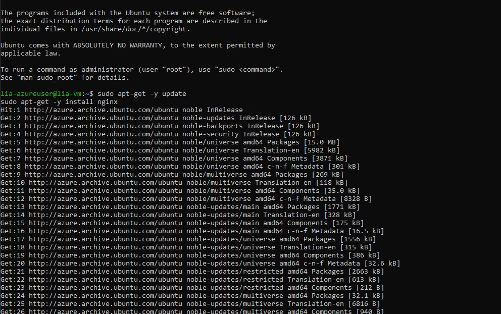
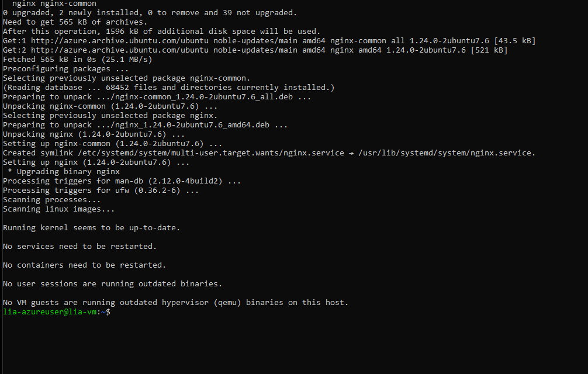

# SSH Web Setup

**Project Section**: SSH key setup and web server installation for the deployed VM.

**Goal**: Configure secure SSH access and install Nginx; verify service runs locally on the VM.

## Steps taken

1. Generate SSH key pair locally and copy the public key into the VM provisioning step.
   
2. Locate the new VM resource and confirm it's running.
   
3. Connect via SSH using the assigned username and provided private key.
   
4. Install Nginx and start the service; confirm installation finishes without errors.
   
   

**Validation**: On the VM, `systemctl status nginx` returned active and the service was reachable on localhost (further network validation in next section).
