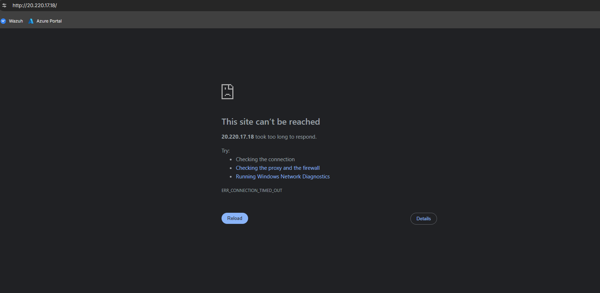
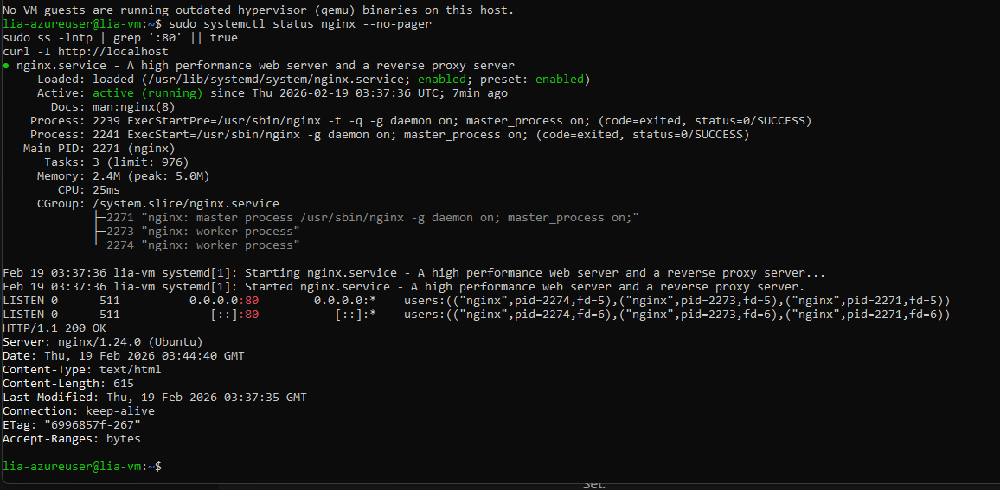
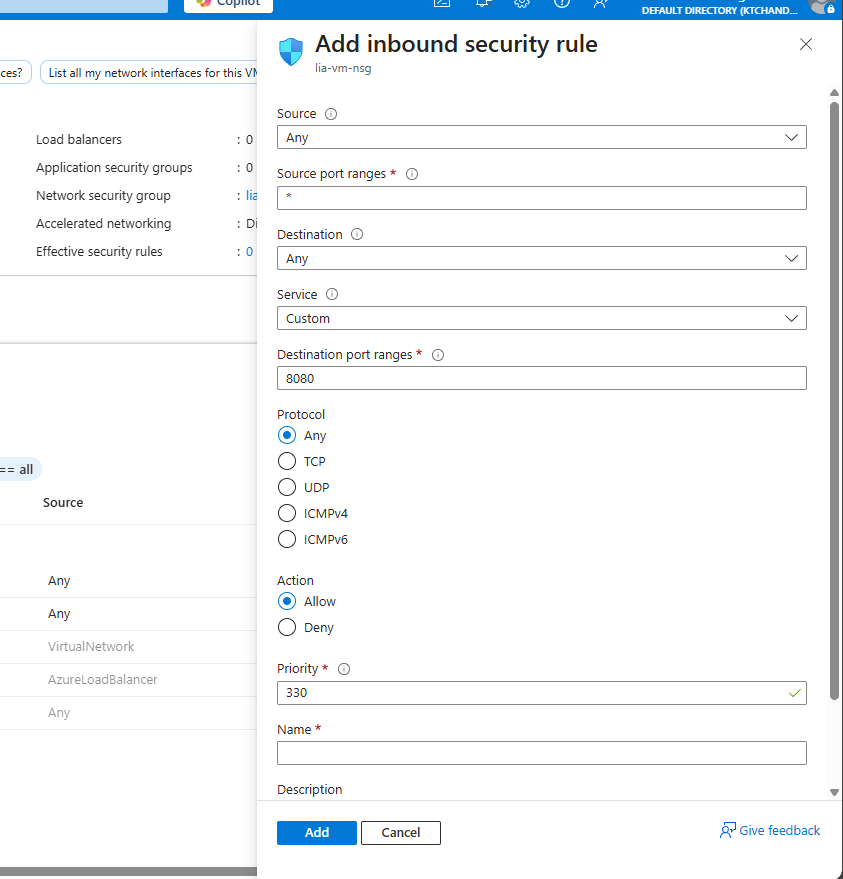
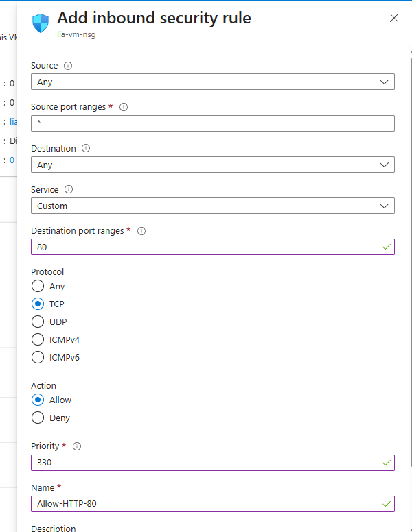
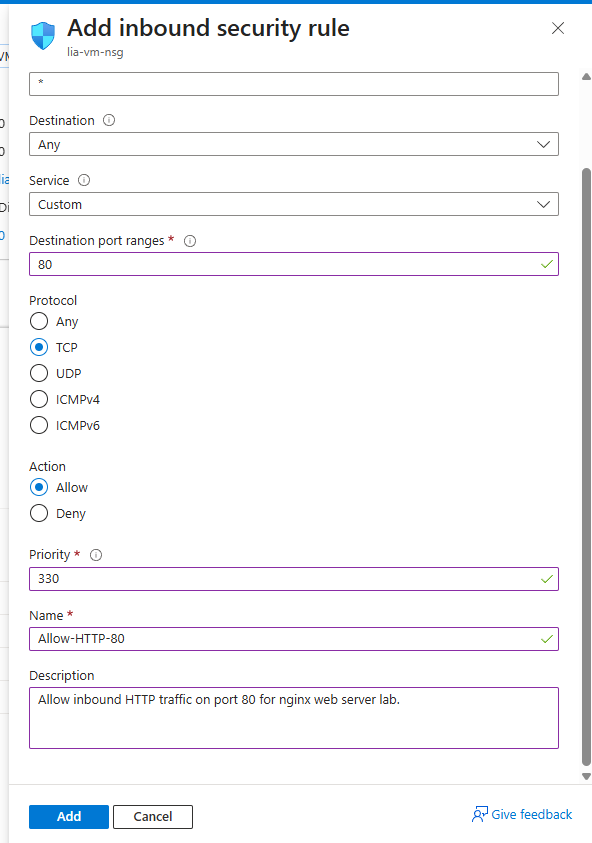
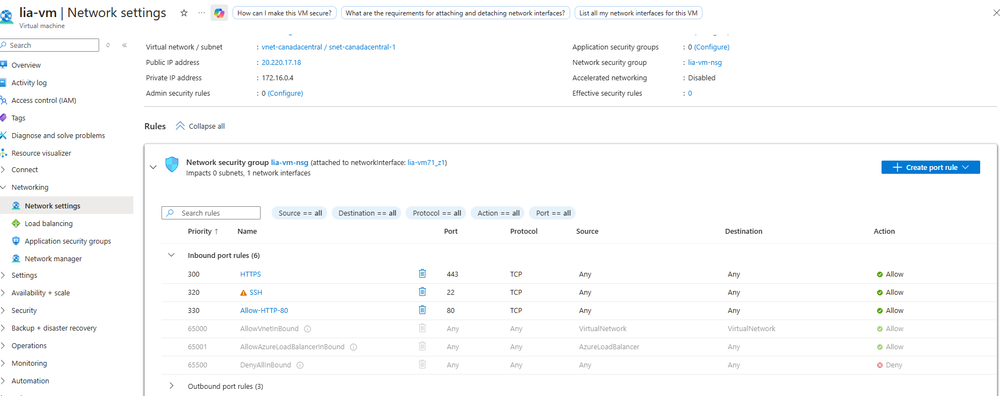
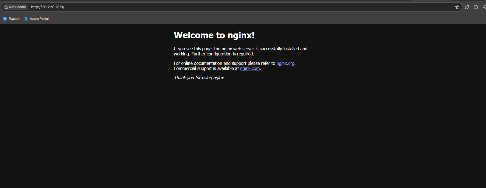

# Network Security Troubleshooting

**Project Section**: Network Security Group (NSG) rules and troubleshooting HTTP reachability.

**Goal**: Diagnose and fix connectivity issues preventing external HTTP access to the VM.

## Symptoms observed

- SSH worked locally but HTTP from the internet failed (browser timed out / connection refused).
  

## Troubleshooting steps

1. Reproduce the failure and capture diagnostic output from the VM and portal.
   
2. Inspect effective security rules and the NSG attached to the VM/subnet.
   
3. Add an inbound security rule allowing TCP port 80 from Internet (source: Any / destination port: 80).
   
   
4. Confirm rule applied and re-test connectivity; browser now loads the default Nginx page.
   
   

**Key takeaway**: Typical public reachability issues stem from missing NSG rules or incorrectly scoped rules; verify both NIC- and subnet-level NSGs.
