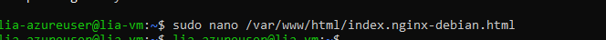
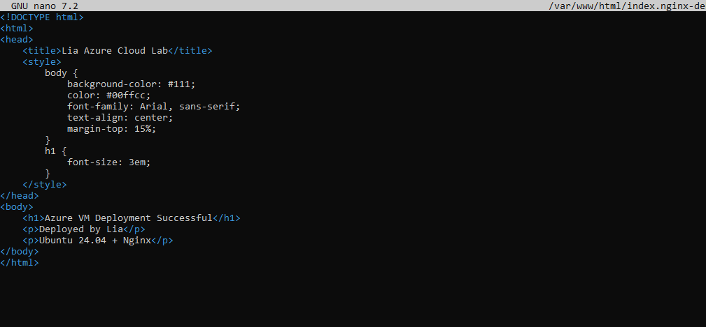
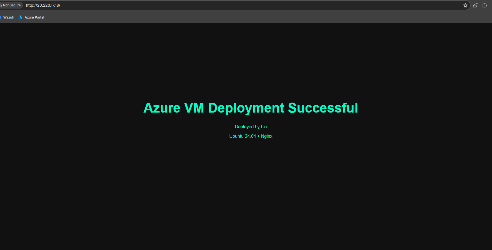

# Validation Enhancement

**Project Section**: Final validation, content customization, and suggested enhancements.

**Goal**: Verify external access, customize the site, and propose next improvements for production hardening.

The custom HTML page used for validation is included in this repository:
[`/web/index.html`](../../web/index.html)

## Validation steps

1. Edit the site content on the VM (replace default index.html with a simple project page).
   
   
2. Re-test from a browser to confirm the customized page renders externally.
   

## Suggested enhancements (portfolio-ready checklist)

- Automate provisioning with an ARM template or Bicep to demonstrate IaC.
- Use Azure Key Vault for secrets and SSH key lifecycle policies.
- Harden the VM: enable automatic security updates, configure a minimal firewall on the guest, and remove password-based SSH.
- Add monitoring: Azure Monitor/Log Analytics and a lightweight uptime probe for the web endpoint.

**Summary**: Lab demonstrates end-to-end provisioning, SSH-based administration, NSG debugging, and a small content change.
